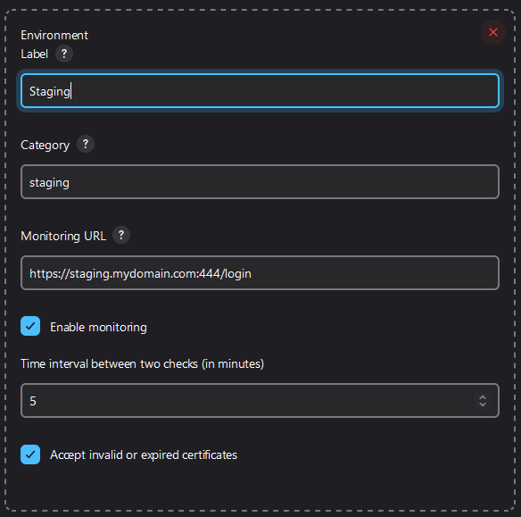
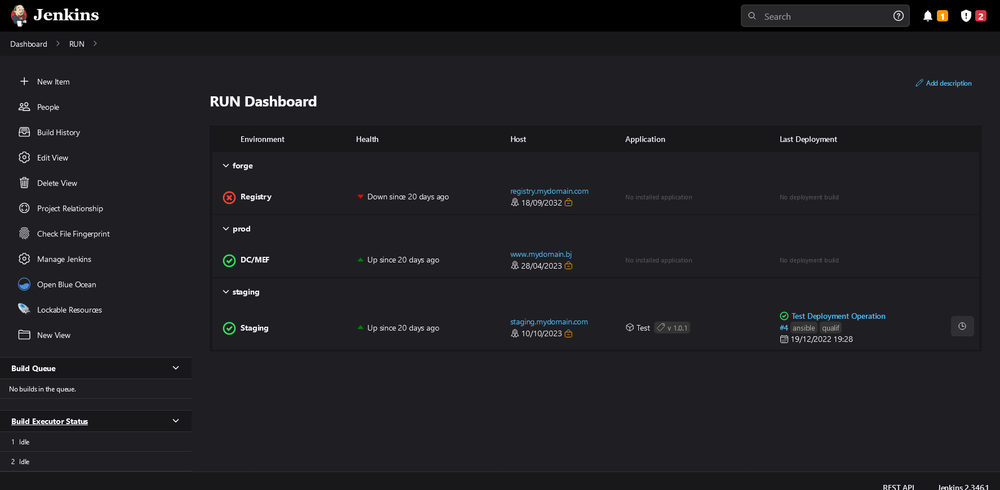

# DevOps Portal Jenkins Plugin

A Jenkins Dashboard Plugin with many features :

1. Offer a specific **dashboard** to track 🚀 **RUN operations**
    - Environments **monitoring** (service availability)
    - HTTPS certificate validity and expiration monitoring
    - **Operations** tracking, like Deployments or Rollback (target environment, application and version, related run)
2. Offer a specific **dashboard** to bring together all applications 📦 **BUILD activities**
    - Display all built **applications with versions**
    - Link to the last build run
    - Last application **deployment** information are also displayed
    - Gather useful information in the same place: **artifacts** built and size of them, **unit tests** performed,
      **code quality** metrics, application **performance** metrics and published containers **images**

## ⚡ Manage Environments

In Jenkins Administration, a link allows to configure managed environments:


Then you can configure each environment to manage:



You have to provide:
- An unique label
- A category (like production, staging, ...)
- An optional monitoring URL
- A time interval (in minutes) between two monitoring checks
- A flag to accept invalid certificates (for monitoring URL)

## 🚀 Manage Run Operations

Since you configured your environments, you can create a dashboard.

Create new dashboard using: `View` > `+ button` > View type: `Run Dashboard`

Dashboard :



### Report run operation using Jenkins GUI


### Report run operation with pipeline script

```
reportRunOperation(
    targetService: string,      // Name for target environnement to deploy to
    applicationName: string,    // Name of application deployed
    applicationVersion: string, // Version of application deployed
    operation: string,          // Operation code
    status: boolean,            // Status
    tags?: string               // Optional: comma-separated list
)
```

Operation codes:

- DEPLOYMENT
- ROLLBACK

## 📦 Manage Build Activities

Create new dashboard using: `View` > `+ button` > View type: `Build Dashboard`

Dashboard :


### Report build activity using Jenkins GUI


### Report build activity with pipeline script

Pipeline script :

```
reportBuild(
    applicationName: string,       // Name of application built
    applicationVersion: string,    // Version of application built
    applicationComponent: string   // Name of application component built
    artifactFileName?: string,     // Optional: full path to generated artifact
    artifactFileSize?: long,       // Optional: file size of generated artifact
    dependenciesToUpdate?: int     // Optional: nomber of outdated dependencies
)
```

```
reportUnitTest(
    applicationName: string,       // Name of application built
    applicationVersion: string,    // Version of application built
    applicationComponent: string   // Name of application component built
    testCoverage?: float,          // Optional: coverage ratio (between 0-1)
    testsPassed?: int,             // Optional: number of passed tests
    testsFailed?: int,             // Optional: number of failed tests
    testsIgnored?: int             // Optional: number of skipped tests
)
```

```
reportImageRelease(
    applicationName: string,       // Name of application built
    applicationVersion: string,    // Version of application built
    applicationComponent: string   // Name of application component built
    registryName?: string,         // Optional: registry server name
    imageName?: string,            // Optional: image name released
    tags?: string                 // Optional: comma-separated list of image's tags
)
```

## Contribute

1. Checkout project
2. Recommended IDE : Intellij IDEA
3. Run with: `mvn hpi:run -Djetty.port=5000`
4. Release with: `mvn package`

Current supported translations: 🇫🇷 🇬🇧
